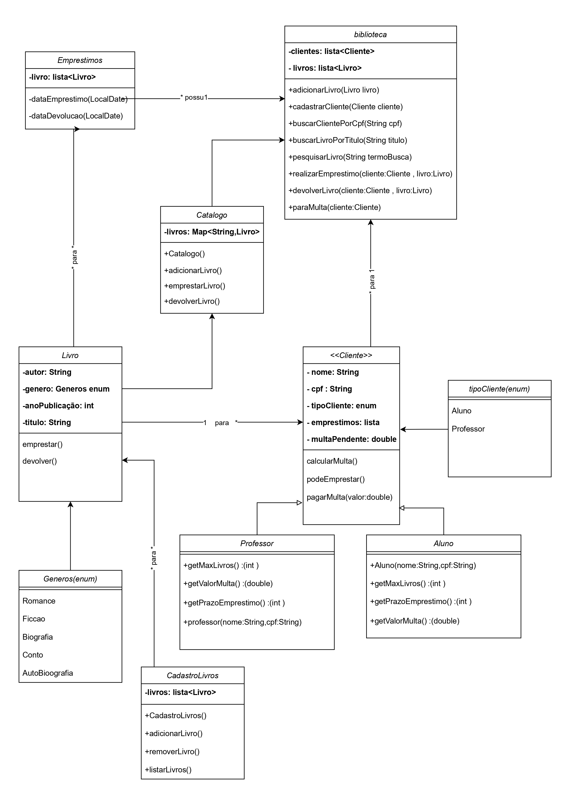

# Olá, bem vindo(a) ao nosso trabalho!
Integrantes: Letícia e Victor hugo

## Partes do trabalho responáveis de cada integrante:
Letícia:
* Main (BibliotecaApp);
* Cadastro de Clientes;
* Empréstimo de Livros (verificar limite de livros e atualizar número de exemplares);
* Pagamento de Multas;
* Pesquisa de Livros;

Victor:
* Diagrama de Classes;
* Cadastro de Livros;
* Empréstimo de Livros (Impedir empréstimos caso multa pendente e Definir data de devolução);
* Devolução de Livros e Multas;
* listagem de Livros e Clientes 

## Responsabilidades adicionais de cada integrante:
Letícia:
* Revisão da lógica dos códigos;
* Ordenar os códigos para que ficasse mais claro o entendimento;
* Arrumar alguns bugs nas classes;

Victor:
* Testar o código;
* Aplicar revisões no código;
* Rever a nomeação das variáveis;

# Diagrama de Classes:

